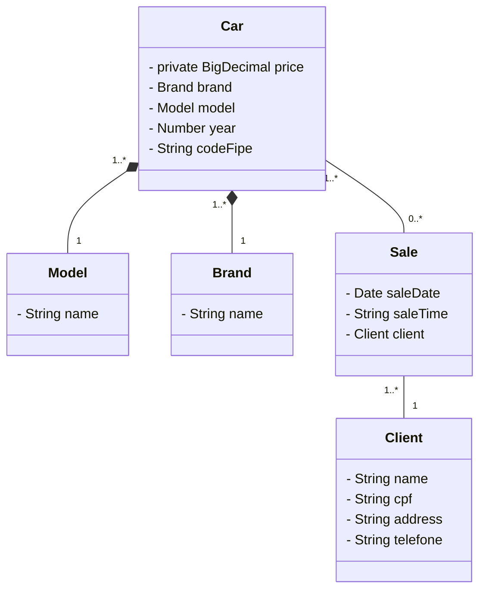

# Concessionária de Carros

Java RESTful API criada para o Desafio de projeto na DIO.

## Principais Tecnologias
 - **Java 17**: Utilizei a versão LTS do Java para tirar vantagem das últimas inovações que essa linguagem robusta e amplamente utilizada oferece;
 - **Spring Boot 3**: Trabalhei com a mais nova versão do Spring Boot, que maximiza a produtividade do desenvolvedor por meio de sua poderosa premissa de autoconfiguração;
 - **Spring Data JPA**: Foi utilizada para lidar e simplificar nossa camada de acesso aos dados, facilitando a integração com bancos de dados SQL;
 - **OpenAPI (Swagger)**: Foi criado uma documentação de API eficaz e fácil de entender usando a OpenAPI (Swagger), perfeitamente alinhada com a alta produtividade que o Spring Boot oferece;
 - **Render**: Foi utilizado o Render como alternativa ao Railway para deploy da aplicação utilizando docker.


## Diagrama de Classes (Domínio da API)



## 📚 Sobre o Projeto

O projeto representa uma aplicação web para uma concessionária de automóveis, tendo por sua vez os CRUDs, e um sistema com seus clientes, carros e vendas.

Podendo assim ter um gerenciamento de uma agência de veículos e o monitoramento das partes envolvidas.


Para usar este projeto, siga estas etapas:

1. Clone este repositório para o seu computador:

```bash
git clone github.com/JamesCode-Ts/car_dealership
```

2. Configuração do Ambiente Java com SDKMAN!

```bash
curl -s "https://get.sdkman.io" | bash
sdk install java 17.0.6-tem
sdk use java 17.0.6-tem
```

3. Execute a aplicação na ide de sua preferencia.
   
4. Para realizar testes e consultas no localhost:
```bash
 http://localhost:8080/swagger-ui/index.html
```


### Documentação Interativa

Para explorar e testar os endpoints da API, consulte a [Documentação interativa](https://car-dealership-relj.onrender.com/swagger-ui/index.html#/).
